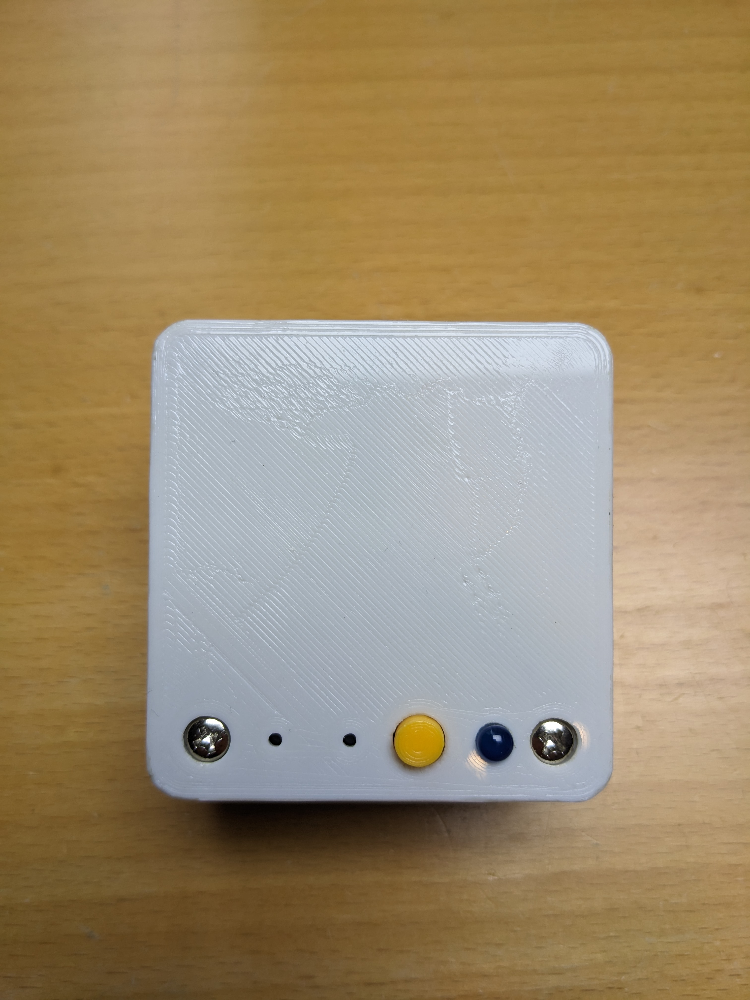

# iot-light-switch-v2

Embedded arduino + RF implementation of light switch.

- [Light Switch](#light-switch)
- [Base Station](#light-switch)

## Light Switch

### Motherboard

### Daughterboard

The daughterboard has two roles

1. To connect a small momentary switch for the front bumper to the motherboard
2. To connect the battery temperature monitoring thermocouple to the motherboard

## Base Station

