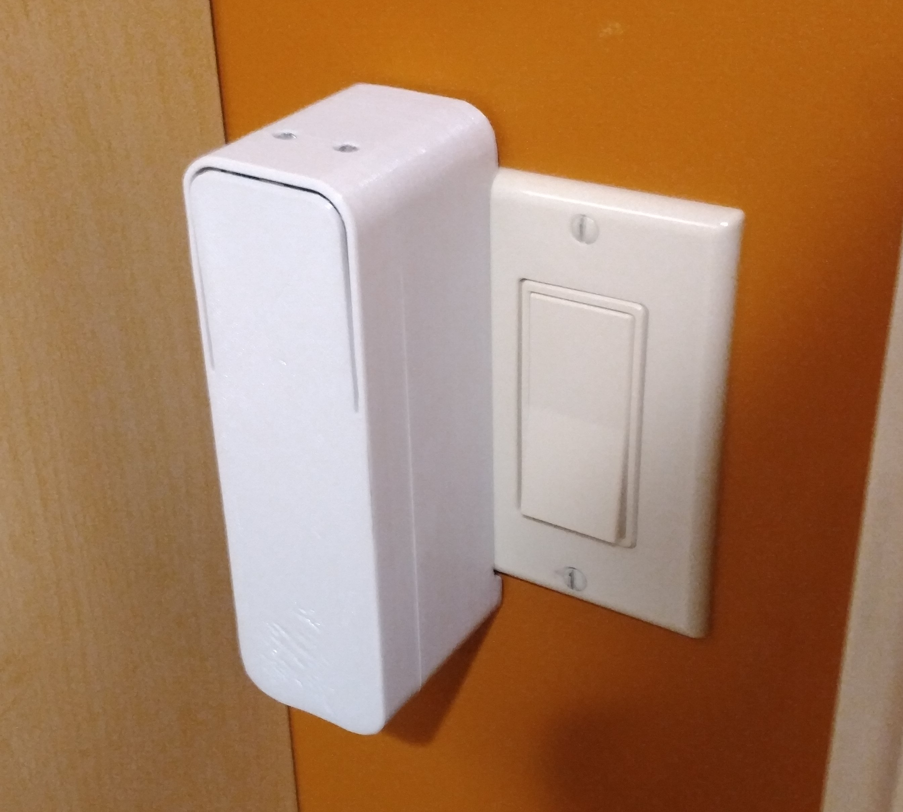

# iot-light-switch-v2

An internet-connected voice-controlled easy-to-use lightswitch controller.

## Features

1. Voice control through google-assistant.
2. Extremely long battery life. The wall-mounted lightswitcher can achieve a very low energy sleep state while the base station remains connected to the internet waiting for commmands.
3. Tool-less magnetic installation.
4. Compatibility with both rocker and post style switches.
5. USB rechargable Li-ion battery pack.
6. Side-by-side installation thanks to narrow width.
7. Contact activation through subtle physical switch.

## Subsystems

- [Light Switch](#light-switch)
  - [Motherboard](#motherboard)
  - [Daughterboard](#daughterboard)
- [Base Station](#light-switch)

## Light Switch

### Motherboard

### Daughterboard

The daughterboard has two roles

1. To connect a small momentary switch for the front bumper to the motherboard
2. To connect the battery temperature monitoring thermocouple to the motherboard

## Base Station

