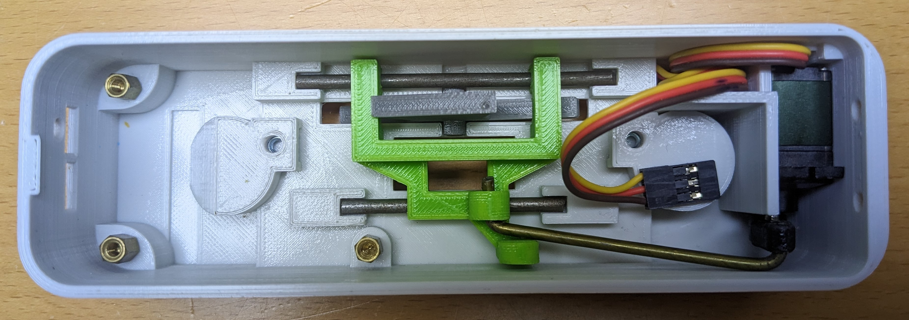
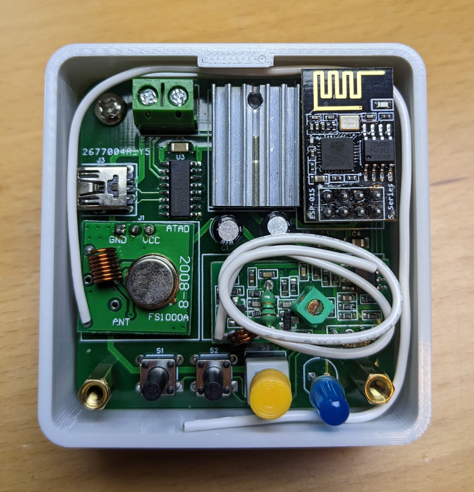
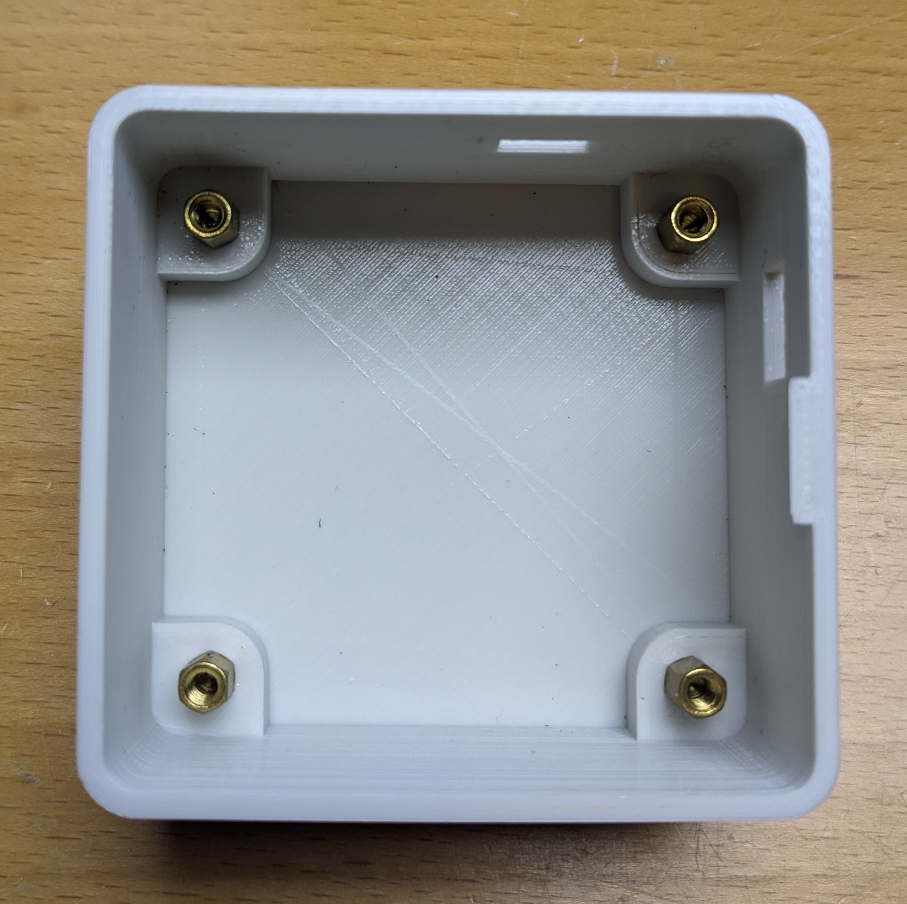

# iot-light-switch-v2

An internet-connected voice-controlled easy-to-use lightswitch controller.

## Features

1. Voice control through google-assistant.
2. Extremely long battery life. The wall-mounted lightswitcher can achieve a very low energy sleep state while the base station remains connected to the internet waiting for commmands.
3. Tool-less magnetic installation.
4. Compatibility with both rocker and post style switches.
5. USB rechargable Li-ion battery pack.
6. Side-by-side installation thanks to narrow width.
7. Contact activation through subtle physical switch.

## Limitations

1. The low-energy 433Mhz radios I selected are not suitable for this project as they are extremely unreliable and require a complicated software state-machine to service. A better choice would have been something like the `NRF24L01+` which includes automatic retransmission, multicast and an extremely low power consumption in sleep. See [this](https://github.com/jarpoole/NRF24L01_driver) project for more.

2. The `ESP8266` WiFi module is not powerful enough to act as a base station for multiple devices. Its single processing core is mostly preoccupied with handling the networking stack and cannot be blocked by user software for two long without connectivity problems. A more modern SoC like the `ESP32` would have been a much better choice.

## Subsystems

- [Light Switch](#light-switch)
  - [Motherboard](#motherboard)
  - [Daughterboard](#daughterboard)
  - [Actuator](#actuator)
- [Base Station](#light-switch)

## Light Switch

### Motherboard

1. Low-energy 433Mhz radios
2. Deep-sleep enabled by a 32768Hz oscillator and timer interrupt
3. BMS built around the Texas Instruments BQ25890 buck-boost charge controller. Charges 3.7 Li-ion battery pack from 5v USB power (buck) and produces 5v system power from battery pack when in operation (boost)
4. Audio feedback from a buzzer
5. Integrated USB debug/serial output
6. ICSP programming header

### Daughterboard

The daughterboard has two roles

1. To connect a small momentary switch for the front bumper to the motherboard
2. To connect the battery temperature monitoring thermocouple to the motherboard

### Actuator

The actuator is compatible with both post-style and rocker-style switches. The slide engages with post-style while the vertial rocker engages the rocker-style.

## Base Station

The base station's primary responsibility is to act as a bridge between the internet and the low-energy 433Mhz radio on the light-switch.

1. WiFi connectivity using ESP8266
2. Dual power-supply options
   - Mini USB
   - Terminal block 5V DC
3. Integrated USB debug/serial output
4. Captive portal configuration through a mobile browser

