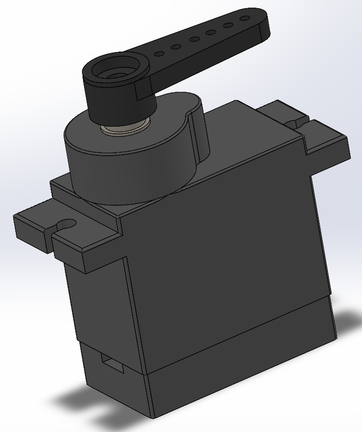
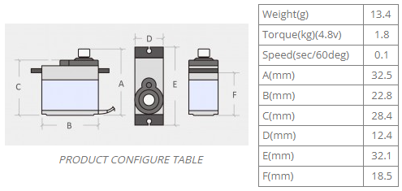

# TowerPro MG90 Micro Servo

## Render

## Specifications

- Weight: 13.4g
- Dimension: 22.8×12.2×28.5mm
- Stall torque: 1.8kg/cm (4.8V); 2.2kg/cm (6.6V)
- Operating speed: 0.10sec/60degree (4.8V); 0.08sec/60degree (6.0V)
- Operating voltage: 4.8V
- Temperature range: 0℃_ 55℃
- Dead band width: 1us
- Power Supply: Through External Adapter
- servo wire length: 25 cm
- Servo Plug: JR (Fits JR and Futaba)

## Dimensions

